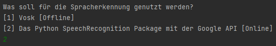

# AI Helfer

Der AI Helfer soll eine leichte Möglichkeit sein, Fragen [durch Reden] an OpenAIs GPT-3 zu stellen. Dabei werden die 
Antworten auch vorgelesen (Die Stimme lässt sich in der "speak" Funktion ändern, genau in der "setProperty" Funktion).
Wie Sprache erkannt werden soll lässt sich vor dem Gespräch auswählen. Dabei kann der User sich zwischen Vosk und dem 
Python [SpeechRecognition Module](https://pypi.org/project/SpeechRecognition/) entscheiden. 



Das SpeechRecognition Module nutze ich hier mit der Google API. Das SpeechRecognition ist außerdem schneller, da es Googles API nutzt, wohingegen Vosk
ein ganzes Modell laden muss, da es komplett offline basiert ist und das Modell das einzige ist, wodurch es Gesprochenes
erkennen kann. Außerdem sollte (damit die AI auch "Kontext" hat) Infos über die Aufgaben der AI, sowie ein Beispiel in der
*prompt_text.txt* stehen. Die prompt_text.txt sah für meine Test wie folgt aus:
```
Ich bin ein hochintelligenter Fragen beantwortender Bot.

Person: Wie funktioniert ein Telefon?

AI: Beim Telefonieren stellt das Handy eine Funkverbindung mit der nächsten Basisstation her. Deren Empfangsantenne nimmt die Signale auf und leitet sie über Kabel oder Richtfunk zur nächsten Funkvermittlungsstelle weiter. Dort wird das Gespräch auf das Festnetz umgestellt und zum gewünschten Telefonanschluss vermittelt.
```
## Damit das ganze Projekt ohne Fehler funktioniert, muss die Datei/ Order- Struktur so aussehen:

#### Dabei sollte das Vosk Modell in dem "Vosk" Ordner liegen. 

## Nach dieser Einleitung könnt ihr euren Open AI Key und eure Beispiele eintragen und loslegen!🚀

Hier ist noch ein "Gespräch", welches ich mit der AI hatte:

```
Person:wann ist deutschland entstanden

AI: Deutschland ist am 18. Januar 1871 entstanden.

Person:was ist spotify

AI:Spotify ist ein digitaler Musikdienst, der dir Zugriff auf Millionen von Songs ermöglicht. Du kannst Musikstreaming über die Spotify-App auf deinem Mobilgerät oder Computer genießen.

Person:wer ist der reichste mensch der welt

AI:Derzeit wird Jeff Bezos, Gründer und CEO von Amazon, als der reichste Mensch der Welt gehandelt. Sein Vermögen wird auf rund 150 Mrd. US-Dollar geschätzt.
```
